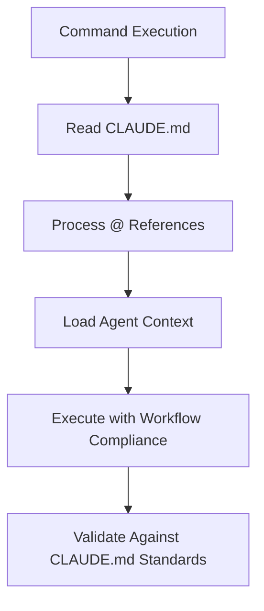

# CLAUDE.md Integration Framework

## Purpose
This document defines how `CLAUDE.md` integrates with agents, commands, and the overall SuperCrew framework to ensure consistent workflow awareness and execution.

## CLAUDE.md Structure

### Entry Point File
```markdown
<sc-v1.0.0>
# Claude Code Super Crew Entry Point

@COMMANDS.md
@FLAGS.md
@PRINCIPLES.md
@RULES.md
@MCP.md
@PERSONAS.md
@ORCHESTRATOR.md
@MODES.md

[9-step workflow definition]
<sc-end-v1.0.0>
```

### @ Reference System
The @ syntax creates file references that should be processed by agents:

| Reference | Purpose | Location |
|-----------|---------|----------|
| `@COMMANDS.md` | Command definitions and execution patterns | `~/.claude/COMMANDS.md` or `SuperCrew/core/COMMANDS.md` |
| `@FLAGS.md` | Available flags and usage guidelines | `~/.claude/FLAGS.md` or `SuperCrew/core/FLAGS.md` |
| `@PRINCIPLES.md` | Framework principles and design philosophy | `~/.claude/PRINCIPLES.md` or `SuperCrew/core/PRINCIPLES.md` |
| `@RULES.md` | Framework rules and constraints | `~/.claude/RULES.md` or `SuperCrew/core/RULES.md` |
| `@MCP.md` | MCP server integration guidelines | `~/.claude/MCP.md` or `SuperCrew/core/MCP.md` |
| `@PERSONAS.md` | Available personas and their specialties | `~/.claude/PERSONAS.md` or `SuperCrew/core/PERSONAS.md` |
| `@ORCHESTRATOR.md` | Orchestration patterns and workflows | `~/.claude/ORCHESTRATOR.md` or `SuperCrew/core/ORCHESTRATOR.md` |
| `@MODES.md` | Execution modes and their applications | `~/.claude/MODES.md` or `SuperCrew/core/MODES.md` |

## Agent Integration Requirements

### Required Tools
All orchestrator agents MUST have the `Read` tool to access CLAUDE.md:
```yaml
tools: [Read, Write, Grep, Bash, Glob, LS, Edit, MultiEdit, TodoWrite, Task]
```

### Workflow Protocol
Agents must follow the CLAUDE.md Integration Protocol:

1. **Read CLAUDE.md First** - Always start by reading project's `./CLAUDE.md`
2. **Process @ References** - Load referenced files for context
3. **Follow 9-Step Workflow** - Adhere to defined workflow steps
4. **Maintain Simplicity** - Honor simplicity principles throughout
5. **Update todo.md** - Use TodoWrite tool as specified in workflow

### Context Resolution Order
```yaml
CONTEXT_RESOLUTION:
  1: "Read ./CLAUDE.md (project-specific)"
  2: "Read ~/.claude/CLAUDE.md (global framework)"
  3: "Process @ references from both files"
  4: "Apply workflow requirements from project CLAUDE.md"
  5: "Fall back to global standards if project specifics missing"
```

## Command Integration

### /crew:load Enhancement
The load command now includes CLAUDE.md integration:
- Phase 1 includes CLAUDE.md context loading
- @ reference processing for comprehensive context
- Workflow validation and todo.md creation
- Orchestrator agents receive CLAUDE.md context

### Execution Flow


## Implementation Status

### ✅ Completed
- Added CLAUDE.md Integration Protocol to orchestrator-specialist
- Enhanced global orchestrator with CLAUDE.md awareness
- Updated /crew:load command with CLAUDE.md integration
- Created comprehensive documentation

### ⚠️ Pending Implementation
- @ Reference processor in Go code
- Automatic CLAUDE.md context injection
- Workflow step validation
- Integration with slash command execution

## Usage Guidelines

### For Agents
1. Always read CLAUDE.md before task execution
2. Process @ references to understand context
3. Follow the 9-step workflow consistently
4. Validate work against CLAUDE.md quality standards

### For Commands
1. Load CLAUDE.md context at command start
2. Resolve @ references for comprehensive understanding
3. Apply workflow requirements throughout execution
4. Ensure agents receive proper CLAUDE.md context

### For Users
1. Customize CLAUDE.md for project-specific workflows
2. Use @ references to organize framework knowledge
3. Expect agents to follow CLAUDE.md defined processes
4. Update CLAUDE.md when workflow requirements change

## Quality Assurance

### Validation Checklist
- [ ] Agent has Read tool access
- [ ] CLAUDE.md is read before task execution
- [ ] @ references are processed and understood
- [ ] 9-step workflow is followed
- [ ] Simplicity principles are maintained
- [ ] todo.md is updated as required
- [ ] Work is validated against CLAUDE.md standards

This integration ensures that all framework components understand and enforce the workflow defined in CLAUDE.md, creating consistent behavior across agents and commands.